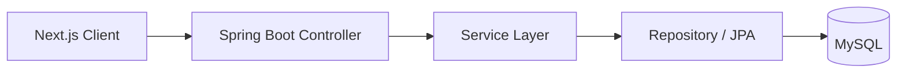

<h1 align="center">Hi, I'm Pop (Sirapop Chantawong) 👋</h1>
<p align="center">Fullstack Developer in training — building from the data model up.</p>

<p align="center">
  
  
  
</p>

---

### About me

I'm a Web Development student at **Maejo University**. My background is in Java-based backend
development — I like starting from the data model (entities, relationships) and building outward:
repository → service → controller, then the frontend that sits on top.

I don't have a formal internship yet, so the best evidence of what I can do is the software I'm
actively designing and building in coursework — see below.

```txt
role        : Fullstack Developer (student)
core stack  : Java · Spring Boot · Hibernate/JPA · MySQL · Next.js
currently   : Building the Moving Service System (see pinned project)
looking for : Web Development / Fullstack roles
```

---

### 🔧 Skills & Tools

**Backend**
`Java` `Spring Boot` `Hibernate / JPA` `REST API Design` `Layered Architecture`

**Frontend**
`Next.js` `JavaScript` `HTML5` `CSS3`

**Database**
`MySQL` `ER Modeling` `UUID-based Schema Design`

**Tools**
`Git` `StarUML` `Rational Rose` `Spring Initializr`

---

### 🚧 Featured Project — Moving Service System
*Academic capstone · In progress*

**The problem.** Moving companies juggle quotations, staff scheduling, and payment across
disconnected steps. This project is a platform that takes a customer from "I need a quote" all
the way through job assignment, live status tracking, and payment — modeled on a real moving
company as a case study.

**My role.** I own the system design and backend build end-to-end: the domain model, the
database schema, and the Spring Boot API — plus the Next.js frontend that consumes it.

**How I approached it.**
1. Modeled the domain first — 11 entities (`Customer`, `Staff`, `RequestService`, `Quotation`,
   `Job`, `Vehicle`, `Equipment`, `Payment`, `Schedule`, `Item`, `Admin`) with UUID primary keys,
   using UML class diagrams and ER diagrams in StarUML and Rational Rose before writing any code.
2. Set up a layered Spring Boot backend — `Controller → Service → Repository`, with DTOs keeping
   the API contract separate from persistence.
3. Designed the harder logic on paper first: matching staff to jobs by license type and
   availability, and a Shopee-style status timeline so customers can see where their job stands.
4. Sketched the UI flow for Quotation → Assign Job → Assign Staff → QR-code payment.



**Where it stands.** The Customer module (repository, DTOs, service, controller) is complete;
the rest of the entities are being built out layer by layer. This is also a committee-review
project, so I'm keeping the design decisions — why entities are split the way they are, why the
ER diagram looks the way it does — documented as I go, since I'll need to defend them.

**What I'm learning.** How much of "backend work" is actually decisions made before any code —
getting the entity relationships right up front has saved me from several reworks later on.

---

### 📫 Reach me

- Email: Sirapop303@gmail.com
- Phone: 081-150-1455
- Location: Chiang Mai, Thailand
